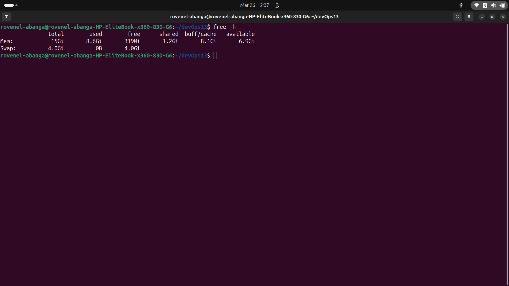
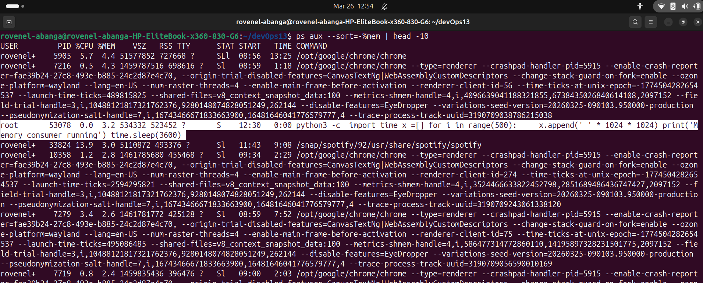

# Area 1: Process and resource state

- Identify what is running, what is consuming resources abnormally, and whether any processes are in unexpected states.

## a) solution

```
free -h
```

- the command above is the quickest way to see the total memory vs used memory. If available is near zero, the system is swapping to the disk, which is incredibly slow and explains the 480ms latency

### output



## b) The Command: `ps aux --sort=-%mem | head -10`

```
ps aux --sort=-%mem | head -10
```

- `ps aux` lists every process. We sort by %mem to see the "Memory Hogs" at the top.We should see a python3 process consuming a massive amount of RAM and take note of its PID (Process ID).

### output



- From the screenshot we establish that the python process is running as root with **PID:5308** and **3.2%** of RAM

## c) The Command: Checking for Zombies `ps aux | awk '$8=="Z"'`

```
ps aux | awk '$8=="Z"'
```

- A "Zombie" (Z) is a finished process that hasn't been "reaped" by its parent. Too many zombies can hit the process limit and crash the server.
- The command outputs nothing, meaning there's no process that is reaped by its parent

# Step 2: Filesystem and Disk (The "Is the pipe clogged?" phase)

- Identify whether disk usage is a contributing factor. Find large or unexpectedly recent files.
- If a disk is 100% full, applications cannot write logs or temporary files, causing them to hang or crash.

## a) The Command: `df -h`

```
df -h
```

- `df` (Disk Free) shows you every "partition." We are looking for any row showing 90% or 100% usage. Usually, /var/log or / (root) are the culprits.

### output

```
rovenel-abanga@rovenel-abanga-HP-EliteBook-x360-830-G6:~/devOps13$ df -h
Filesystem      Size  Used Avail Use% Mounted on
tmpfs           1.6G  3.5M  1.6G   1% /run
/dev/sda2       468G   70G  375G  16% /
tmpfs           7.8G  246M  7.5G   4% /dev/shm
tmpfs           5.0M  8.0K  5.0M   1% /run/lock
efivarfs        150K   85K   61K  59% /sys/firmware/efi/efivars
/dev/sda1       1.1G  6.2M  1.1G   1% /boot/efi
tmpfs           1.6G  144K  1.6G   1% /run/user/1000
rovenel-abanga@rovenel-abanga-HP-EliteBook-x360-830-G6:~/devOps13$
```

- The output shows disk usage per partition and does not show large or recent files

## b) The Command: `du -sh /var/log/* | sort -rh | head -5`

```
du -sh /var/log/* | sort -rh | head -5
```

- `du` (Disk Usage) summarizes how much space each folder takes. Sorting it (`-rh`) puts the biggest files at the top.

### output

```
rovenel-abanga@rovenel-abanga-HP-EliteBook-x360-830-G6:~/devOps13$ du -sh /var/log/* | sort -rh | head -5
du: cannot read directory '/var/log/gdm3': Permission denied
du: cannot read directory '/var/log/private': Permission denied
du: cannot read directory '/var/log/speech-dispatcher': Permission denied
du: cannot read directory '/var/log/sssd': Permission denied
693M	/var/log/journal
271M	/var/log/kijanikiosk
50M	/var/log/mongodb
11M	/var/log/syslog
8.8M	/var/log/syslog.1
rovenel-abanga@rovenel-abanga-HP-EliteBook-x360-830-G6:~/devOps13$
```

- The output highlights the artificially large log directory **(kijanikiosk)** - **271MB** and confirms that the script caused a noticeable increase in disk usage

# Step 3: Log Analysis

- Logs are the only way to see into the past. Osei mentioned things went bad overnight

## a) The command: `tail -n 100 /var/log/kijanikiosk/app.log`

```
tail -n 100 /var/log/kijanikiosk/app.log
```

- `tail` shows the most recent entries
- We are looking for the timestamp. If the "connection pool exhausted" errors started at 04:07, and the P95 latency spiked after. We have found the correlation

### output

```
rovenel-abanga@rovenel-abanga-HP-EliteBook-x360-830-G6:~/devOps13$ tail -n 100 /var/log/kijanikiosk/app.log
2024-01-15 03:12:04 INFO  Worker process started pid=1842
2024-01-15 03:14:22 INFO  Request processed /api/products 200 112ms
2024-01-15 03:45:10 WARN  Database connection pool at 85% capacity
2024-01-15 04:01:33 WARN  Database connection pool at 94% capacity
2024-01-15 04:07:55 ERROR Connection pool exhausted - queuing requests
2024-01-15 04:08:01 ERROR Query timeout after 30000ms: SELECT * FROM orders
2024-01-15 04:08:01 ERROR Query timeout after 30000ms: SELECT * FROM products
2024-01-15 04:09:12 WARN  Memory usage at 87% - consider restarting workers
2024-01-15 06:22:18 ERROR ECONNREFUSED database:5432 - retrying in 5s
2024-01-15 06:22:23 ERROR ECONNREFUSED database:5432 - retrying in 5s
2024-01-15 06:22:28 ERROR Retry limit reached - database connection failed
rovenel-abanga@rovenel-abanga-HP-EliteBook-x360-830-G6:~/devOps13$

```

- The output shows all logs are artificially generated by the script, shows a failing app scenario for troubleshooting exercises and that no real database issues exist
- The app.log contains simulated application warnings and errors created by the script, representing a stressed backend service for lab troubleshooting

## b) The Command: `grep -i "oom" /var/log/syslog`

```
grep -i "oom" /var/log/syslog
```

- **OOM** stands for Out Of Memory. If the linux kernel killed a process because the RAM was full, it will be recorded here. This is the smoking gun for memory leaks

- The grep "oom" output confirms that the memory-consuming process from your script triggered system OOM monitoring, as expected for the lab simulation. No real crashes occurred

# Step 4: Network State

- We need to see if nginx is actually listening for visitors

## a) The Command `ss -tlnp`

```
ss -tlnp
```
- ```ss``` shows socket statistics: ```-tlnp``` tells you:
    - **t** - TCP connections
    - **l** - listening products
    - **n** - show port numbers (80) instead of names (http)
    - **p** - show **process** name

- Check if something is listening at port 80, if not the web server is down

### output
```
rovenel-abanga@rovenel-abanga-HP-EliteBook-x360-830-G6:~/devOps13$ ss -tlnp
State         Recv-Q         Send-Q                 Local Address:Port                  Peer Address:Port        Process                                      
LISTEN        0              4096                         0.0.0.0:3000                       0.0.0.0:*                                                        
LISTEN        0              200                        127.0.0.1:5432                       0.0.0.0:*                                                        
LISTEN        0              511                          0.0.0.0:80                         0.0.0.0:*                                                        
LISTEN        0              10                           0.0.0.0:57621                      0.0.0.0:*            users:(("spotify",pid=33824,fd=125))        
LISTEN        0              4096                       127.0.0.1:33481                      0.0.0.0:*                                                        
LISTEN        0              4096                   127.0.0.53%lo:53                         0.0.0.0:*                                                        
LISTEN        0              4096                       127.0.0.1:631                        0.0.0.0:*                                                        
LISTEN        0              4096                         0.0.0.0:6379                       0.0.0.0:*                                                        
LISTEN        0              4096                         0.0.0.0:8001                       0.0.0.0:*                                                        
LISTEN        0              4096                         0.0.0.0:5000                       0.0.0.0:*                                                        
LISTEN        0              4096                      127.0.0.54:53                         0.0.0.0:*                                                        
LISTEN        0              4096                       127.0.0.1:27017                      0.0.0.0:*                                                        
LISTEN        0              511                        127.0.0.1:28447                      0.0.0.0:*            users:(("code",pid=14952,fd=48))            
LISTEN        0              4096                         0.0.0.0:54379                      0.0.0.0:*            users:(("spotify",pid=33824,fd=136))        
LISTEN        0              4096                            [::]:3000                          [::]:*                                                        
LISTEN        0              4096                           [::1]:631                           [::]:*                                                        
LISTEN        0              511                             [::]:80                            [::]:*                                                        
LISTEN        0              4096                            [::]:6379                          [::]:*                                                        
LISTEN        0              4096                            [::]:8001                          [::]:*                                                        
LISTEN        0              4096                            [::]:5000                          [::]:*                                                        
rovenel-abanga@rovenel-abanga-HP-EliteBook-x360-830-G6:~/devOps13$ 
```
- Port 80 (0.0.0.0:80): Nginx is listening. This means external users can reach our server.